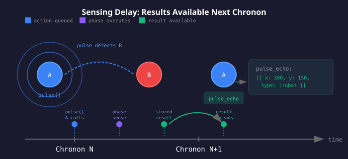

# Rubowar

A competitive programming game where Ruby club members write Ruby classes to control robots ("Rubots") that battle in an arena. The engine is a standalone Ruby gem with a pluggable renderer interface.

## Hello World - Simplest Bot

```ruby
class HelloBot
  include Rubowar::Rubot
  size :medium

  def act
    rotate_turret(10)        # Spin turret (1 energy)
    fire(5) if energy > 20   # Fire when we have energy (5 energy)
  end
end

# Run a battle
battle = Rubowar::Battle.local([HelloBot, HelloBot])
battle.run
puts "Winner: #{battle.winner.rubot_class.name}"
```

This bot spins and shoots when it has energy. Medium size regenerates 16 energy/turn, so it stays sustainable!

## Learning Path

**New to Rubowar?** Start with the [Tutorial](TUTORIAL.md) for a hands-on introduction, then study the sample bots in order of complexity:

1. **Spinner** - Stationary turret, learn the basics
2. **Tracker** - Target tracking with SimpleTargeting mixin
3. **Coroner** - Corner camping with state machines
4. **Evader**  - Counter-intelligence and evasion tactics
5. **Crusher** - Wall-ramming specialist
6. **Hunter**  - Adaptive predator with size-based tactics
7. **Hugger**  - Expert wall-hugging minimal movement

See [`SAMPLE_BOTS.md`](SAMPLE_BOTS.md) for detailed explanations of each bot and what you'll learn.

## Quick Start

```ruby
class MyRubot
  include Rubowar::Rubot
  size :medium  # :small, :medium, or :large

  def on_spawn
    @heading = rand(360)
  end

  def act
    rotate_turret(10)                       # Rotate turret
    fire(5) if probe                        # Fire when we see someone
    thrust(speed: 3, angle: @heading)       # Move in heading direction
  end
end
```

## Rubot API

### State Accessors (read-only)

| Method                         | Description                                       |
|--------------------------------|---------------------------------------------------|
| `x`, `y`                       | Position in arena                                 |
| `velocity_x`, `velocity_y`     | Current velocity                                  |
| `speed`                        | Velocity magnitude                                |
| `turret_angle`                 | Turret direction (0-360, world coordinates)       |
| `health`                       | Current HP (varies by size)                       |
| `energy`                       | Current energy (max 100)                          |
| `shield_level`                 | Shield strength (0 to max_health, decays 12%/chronon) |
| `arena_width`, `arena_height`  | Arena dimensions                                  |
| `friction`                     | Arena friction (default 0.92)                     |
| `chronon`                      | Current game tick                                 |
| `damage_dealt`, `damage_taken` | Match stats                                       |
| `energons`                     | All energon positions `[{x:, y:}]` (free)         |
| `size`                         | Rubot size (:small, :medium, :large)              |
| `live_rubot_count`             | Number of rubots still alive                      |
| `energon_spawn_interval`       | Ticks between energon spawns (default 50)         |
| `energon_growth_rate`          | Energy growth per chronon (default 1.0)           |

### Actions

| Method                   | Cost                              | Effect                                        |
|--------------------------|-----------------------------------|-----------------------------------------------|
| `thrust(speed:, angle:)` | (speed/1.5)^2 x mass x direction  | Add velocity in world direction               |
| `rotate_turret(degrees)` | ceil(\|degrees\|/24)              | Rotate turret                                 |
| `fire(energy)`           | energy                            | Damage = 1.5 x energy, bullet speed 18        |
| `raise_shields(energy)`  | energy                            | Add to shield (max = HP cap, decays 12%/chronon) |

### Action Processing Order

**Actions are processed in phases, not in the order you call them.** This ensures fairness (no spawn-order advantage) and creates intuitive "move then shoot" behavior.

```
Phase 1: SENSE   → All probe(), scan(), pulse() for all rubots
Phase 2: MOVE    → All thrust(), rotate_turret() for all rubots → physics (movement, collisions)
Phase 3: COMBAT  → All fire(), raise_shields() for all rubots → bullet physics
```

**Energy is deducted in phase order.** If you call `fire(10)` before `pulse(distance: 100)` in your code, the pulse still executes first and uses its energy first:

```ruby
def act
  fire(10)                  # Queued, but processed LAST (combat phase)
  pulse(distance: 100)      # Queued second, but processed FIRST (sense phase)
  thrust(speed: 5, angle: 0) # Processed in middle (move phase)
end
```

With 15 energy available:
- Pulse runs first: costs ~4 energy, leaving 11
- Thrust runs second: costs ~11 energy, leaving 0
- Fire runs last: insufficient energy, fails silently

**Structure your code accordingly.** Check energy before expensive sensing operations, and don't assume fire() will "beat" a pulse() to the remaining energy.

**Bullets spawn from your post-movement position.** You move, then you shoot from where you are - not from where you were.

**Thrust mechanics:**
- `angle` is in world coordinates (0 = east, 90 = north)
- Cost increases with mass (larger rubots cost more to move)
- Changing direction costs more (1.0x same direction, 2.0x opposite)
- If you can't afford full thrust, you get partial thrust and energy drains to zero

**Estimating thrust cost:**

Use `thrust_cost(thrust_speed:, angle:)` to calculate what a thrust will cost based on your current momentum:

```ruby
def act
  escape_angle = angle_to(target_x: 320, target_y: 320) + 180  # Away from center
  cost = thrust_cost(thrust_speed: 6, angle: escape_angle)

  if cost <= energy - 15  # Reserve 15 for combat
    thrust(speed: 6, angle: escape_angle)
  elsif cost <= energy
    thrust(speed: 6, angle: escape_angle)  # Use all energy to escape
  else
    # Can't afford this maneuver, try a cheaper one
    thrust(speed: 3, angle: velocity_angle || 0)  # Coast with momentum
  end
end
```

The `thrust` method reserves minimum cost (assumes 1.0x multiplier) to allow queueing, but actual cost at execution depends on your momentum. Use `thrust_cost` to plan energy budgets accurately.

### Sensing

| Method                                       | Cost                      | Returns                                       |
|----------------------------------------------|---------------------------|-----------------------------------------------|
| `probe(*attributes)`                         | sum of attribute costs    | Line scan in turret direction                 |
| `scan(angle:, distance:, velocity:, owner:)` | 3 + area cost [+2] [+1]   | Arc scan for all targets                      |
| `pulse(distance:, owner:)`                   | 2 + ceil(distance/75) [+1]| Omnidirectional radar ping                    |
| `detect`                                     | 2                         | Counter-intelligence: how many times you were sensed |

**probe() - Single target, detailed info:**

Cost is the sum of requested attributes (1-18 energy total):
| Attribute       | Cost | Returns                 |
|-----------------|------|-------------------------|
| `:size`         | 1    | size category           |
| `:position`     | 4    | x, y coordinates        |
| `:velocity`     | 3    | velocity_x, velocity_y  |
| `:turret_angle` | 2    | turret angle in degrees |
| `:shield`       | 2    | shield_level            |
| `:health`       | 3    | current health          |
| `:energy`       | 3    | current energy          |

```ruby
probe                        # 1 energy  -> defaults to :size
probe(:position)             # 4 energy  -> x, y
probe(:size, :position)      # 5 energy  -> size, x, y
probe(:position, :velocity)  # 7 energy  -> x, y, velocity_x, velocity_y

# Check results next chronon:
probe_echo.found?            # true if target detected
probe_echo.x                 # position (if requested)
probe_echo.velocity_x        # velocity (if requested)
```

**scan() - Multiple targets, position/velocity only:**
- Cost: `3 + ceil(angle/20) + ceil(distance/100)` [+2 for velocity] [+1 for owner]
- Returns ScanEcho containing all rubots and bullets in arc
- Each target is a SenseTarget with x, y, type (:rubot/:bullet)
- With velocity: adds velocity_x, velocity_y
- With owner: adds owner (class name of rubot that fired bullet, nil for rubots)

```ruby
scan(angle: 20, distance: 100)                 # 5 energy
scan(angle: 20, distance: 100, velocity: true) # 7 energy - includes velocity
scan(angle: 90, distance: 300)                 # 11 energy - wide arc scan

# Check results next chronon:
scan_echo.any_rubots?                          # are there any rubots?
scan_echo.rubots                               # filter to only rubots
scan_echo.closest_rubot(to_x: x, to_y: y)      # find nearest rubot
```

**pulse() - Quick 360° awareness ping:**
- Cost: `2 + ceil(distance/75)` [+1 for owner]
- Returns PulseEcho containing all rubots and bullets within radius
- Same API as ScanEcho (any_rubots?, closest_rubot(), etc.)

```ruby
pulse(distance: 75)               # 3 energy
pulse(distance: 100)              # 4 energy
pulse(distance: 100, owner: true) # 5 energy - includes bullet owner info

# Check results next chronon:
pulse_echo.any_rubots?
closest = pulse_echo.closest_rubot(to_x: x, to_y: y)
```

**detect() - Counter-intelligence:**
- Cost: 2 energy
- Returns DetectIntel with probed, scanned, pulsed counts
- Use to detect if enemies are tracking you

```ruby
detect                       # 2 energy

# Check results next chronon:
detect_intel.targeted?       # true if sensed by anyone
detect_intel.probed          # times probed this chronon
```

### Sensing Delay (Important!)

**All sensing results are delayed by one chronon.** Think of it like a radar ping: you send out a signal, it travels to the target and bounces back, and only then do you see the result. In Rubowar, the "travel time" is exactly one chronon.



When you call `probe()`, `scan()`, or `pulse()`, the action is queued and executed during the current chronon's sense phase, but the results aren't available until your `act` method runs on the *next* chronon.

```
Chronon N:
  1. Your act() reads probe_echo    → contains results from Chronon N-1's probe
  2. You call probe(:position)          → queued for this chronon's sense phase
  3. Sense phase executes probe         → result stored internally

Chronon N+1:
  1. Your act() reads probe_echo    → NOW contains Chronon N's results
```

**Sensing Result Objects:**

Results are returned as structured objects with helper methods. They always return empty objects (never nil), so you don't need safe navigation (`&.`):

```ruby
# ProbeEcho - single target result
probe_echo.found?       # Was a target detected?
probe_echo.empty?       # No target found?
probe_echo.x            # Position (if requested)
probe_echo[:x]          # Hash-style access still works

# ScanEcho / PulseEcho - multiple targets
scan_echo.empty?        # No targets found?
scan_echo.rubots        # Filter to only rubots
scan_echo.bullets       # Filter to only bullets
scan_echo.any_rubots?   # Are there any rubots?
scan_echo.closest_rubot(to_x: x, to_y: y)  # Find nearest rubot
scan_echo.each { |t| ... }  # Enumerable support

# DetectIntel - counter-intelligence
detect_intel.targeted?  # Was I sensed by anyone?
detect_intel.probed     # How many times probed
```

**Pattern for using sensing:**

```ruby
def act
  # FIRST: Read results from PREVIOUS chronon's sensing
  # No need for &. - probe_echo is never nil
  if probe_echo.found?
    # We have a target! Aim and fire
    target_angle = angle_to(target_x: probe_echo.x, target_y: probe_echo.y)
    turret_diff = normalize_angle(target_angle - turret_angle)
    rotate_turret(turret_diff.clamp(-20, 20))
    fire(10) if turret_diff.abs < 15
  end

  # THEN: Queue sensing for NEXT chronon
  probe(:position, :velocity)
end
```

**Common mistake - checking results immediately (this won't work):**

```ruby
def act
  probe(:position)           # Queued for execution
  if probe_echo.x            # WRONG! This is LAST chronon's result, not the probe we just queued
    fire(10)
  end
end
```

**Why the delay?** Two reasons:

1. **Realism**: Like a real radar ping, there's a round-trip time. You send the signal out, it hits the target, and the echo returns. In Rubowar, this takes one chronon.

2. **Fairness**: Sensing is processed in phases. All rubots queue their sensing actions, then all probes/scans/pulses execute simultaneously. This prevents spawn-order from affecting who "sees" first. Everyone's radar pings go out at the same time, and everyone gets their echoes back at the same time.

**Special case - `detect()`:** Unlike other sensing actions which report what you sensed in the previous chronon, `detect()` reports counts from the *current* chronon's sense phase. It runs last in the sense phase (after all probe/scan/pulse actions) so it can count how many times other rubots probed/scanned/pulsed you *this* chronon. Like other sensing results, `detect_intel` is read during the *next* chronon's `act()` method, but the data it contains reflects current-chronon sensing activity targeting you.

### Callbacks

```ruby
def on_hit(damage:, direction:)  # Projectile hit
def on_spawn                   # Match start
def on_death                   # Health reached 0
def on_wall                    # Wall collision
def on_collision(other_rubot)  # Rubot collision
def on_energon(amount)         # Collected energon
```

### Rubot Sizes

| Size      | Radius | HP  | Energy Regen | Mass |
|-----------|--------|-----|--------------|------|
| `:small`  | 6      | 50  | +7/chronon   | 0.36 |
| `:medium` | 10     | 90  | +16/chronon  | 1.0  |
| `:large`  | 14     | 120 | +18/chronon  | 1.96 |

**Tradeoffs:**
- **Small**: Harder to hit, cheapest thrust, but least HP
- **Medium**: Balanced baseline
- **Large**: Most HP and regen, but expensive to move and easier to hit

## Arena

- **Dimensions**: Variable (default 800x600)
- **Origin**: Bottom-left (0,0)
- **Angles**: 0 = East, 90 = North, 180 = West, 270 = South
- **Friction**: 0.92 default (velocity *= friction each chronon)
- **Max speed**: No hard cap (friction naturally limits sustained speed)

## Physics

### Movement
- `thrust(speed:, angle:)` adds velocity in the specified world direction
- Cost: `(speed/1.5)^2 x mass x direction_multiplier`
- Direction multiplier: 1.0 (same direction) to 2.0 (opposite direction)
- Friction slows rubots each chronon (velocity *= 0.92)

### Bullets
- Travel 18 u/chronon (rubots can outrun bullets with sustained thrust, but it's energy-expensive)
- Spawn at edge of rubot (position + rubot radius + bullet radius)
- Self-damage is possible (your bullets can hit you if you're fast enough)

### Collision Damage
- **Wall**: `2 + mass × impact_speed × 0.5` (momentum-based)
- **Rubot**: `2 + other_mass × closing_speed × 0.5` (momentum-based)

Larger rubots deal more collision damage due to higher mass.

### Wall Bounce
Wall collisions use realistic impulse physics with elasticity 0.2. Larger rubots retain more velocity due to mass advantage against the wall's effective mass:
- **Small** (0.64 mass): ~15% velocity retained
- **Medium** (1.0 mass): ~21% velocity retained
- **Large** (1.44 mass): ~27% velocity retained

Walls absorb most momentum - they can't be used for free direction changes.

## Energons

Energy power-ups that spawn periodically and grow in value over time.

### Mechanics
- **Spawn rate**: Every 50 chronons (configurable)
- **Starting value**: 1 energy
- **Growth**: +1 energy per chronon alive
- **Collection**: Touch to collect (4 unit radius)
- **Spawn position**: Maximizes minimum distance from all bots, avoids walls (15% buffer)

### Detection
- `energons` accessor returns `[{x:, y:}]` - always visible, free
- Value is hidden until collected (older = more valuable)
- `energon_spawn_interval` and `energon_growth_rate` tell you the rules

### Strategy
- Early collection = small reward, less risk
- Late collection = big reward, more competition
- Spawns away from corners to discourage camping

## Custom Actors

For advanced use cases (web interfaces, AI training, network play), you can create custom actors that control rubots externally.

### Battle Registration Model

Battles use a registration model where actors are registered before the battle starts:

```ruby
# Convenience method for local rubot classes (most common)
battle = Rubowar::Battle.local([MyBot, OpponentBot])
battle.run

# Low-level API for custom actors
event_bus = Rubowar::EventBus.new(chronon_limit: 9000)
arena = Rubowar::Arena.new(width: 640, height: 640, event_bus: event_bus)
battle = Rubowar::Battle.new(arena: arena, event_bus: event_bus)
battle.register(Rubowar::LocalActor.new(MyBot))
battle.register(my_custom_actor)
battle.run
```

### Actor Interface

All actors must implement the duck type interface that `Battle` expects. The easiest way is to include the `RubotActor` and `RubotPhysics` modules:

```ruby
class WebActor
  include Rubowar::RubotActor
  include Rubowar::RubotPhysics

  attr_reader :rubot_class

  def initialize(size: :medium, name: "WebPlayer")
    initialize_actor(size:)
    @rubot_class = Class.new { define_singleton_method(:name) { name } }
    @_actions = { sense: [], move: [], combat: [] }
  end

  def instance = self
  def rubot_actions = @_actions
  def reset_actions = @_actions = { sense: [], move: [], combat: [] }
  def rubot_state=(state) = @_rubot_state = state
  def arena_state=(state) = @_arena_state = state
  def _pending_energy_spend=(val) = @_pending_energy_spend = val

  # Called each chronon - for external actors, this is a no-op
  # Actions are set externally via set_actions before the deadline
  def act; end

  # External control: set actions before Battle's chronon deadline (0.5s)
  def set_actions(sense: [], move: [], combat: [])
    @_actions = { sense:, move:, combat: }
  end

  # Sensing results storage and accessors.
  # LocalActor delegates these to the Rubot instance, but custom actors
  # must implement their own storage since there's no rubot instance.
  def set_sensing_results(probe: nil, scan: nil, pulse: nil, detect: nil)
    @probe_echo = Rubowar::ProbeEcho.from_hash(probe) unless probe.nil?
    @scan_echo = Rubowar::ScanEcho.new(scan) unless scan.nil?
    @pulse_echo = Rubowar::PulseEcho.new(pulse) unless pulse.nil?
    @detect_intel = Rubowar::DetectIntel.from_hash(detect) unless detect.nil?
  end

  attr_reader :probe_echo, :scan_echo, :pulse_echo, :detect_intel

  # Callbacks (override as needed)
  def call_safely = block_given? ? yield(self) : nil
  def call_on_death; end
  def on_spawn; end
  def on_hit(damage:, direction:); end
  def on_wall; end
  def on_collision(other_state); end
  def on_energon(amount); end
  def on_death; end
end
```

### Using Custom Actors

```ruby
# Create battle with custom actor
event_bus = Rubowar::EventBus.new(chronon_limit: 1000)
arena = Rubowar::Arena.new(event_bus: event_bus)
battle = Rubowar::Battle.new(arena: arena, event_bus: event_bus)

web_player = WebActor.new(size: :medium, name: "Player1")
battle.register(web_player)
battle.register(Rubowar::LocalActor.new(Spinner))

# In a separate thread/process, set actions before each chronon deadline
web_player.set_actions(
  sense: [{ type: :probe, attributes: [:position] }],
  move: [{ type: :thrust, speed: 5, angle: 90 }],
  combat: [{ type: :fire, energy: 10 }]
)

battle.run
```

See `BasicActor` in the source for a minimal reference implementation.

## Renderer Interface

The engine emits events for any renderer:

```ruby
battle = Rubowar::Battle.local([Spinner, Tracker])

# Block-based (real-time)
battle.on(:chronon) { |state| render_frame(state) }
battle.on(:death) { |event| play_sound(:death) }
battle.run

# Collect events (replays)
events = battle.run
save_replay(events)
```

**Event types**: `:chronon`, `:death`, `:error`, `:action_failed`, `:energon_spawn`, `:energon_spawn_failed`, `:energon_collect`, `:battle_end`

## Victory

- Last rubot standing wins
- Chronon limit (9,000 chronons) prevents stalemates
- Tiebreaker: most damage dealt, then highest HP percentage

## Error Handling

If rubot code crashes or times out: **20 damage** + skip chronon.

## Command-Line Scripts

Run battles from the command line:

```bash
# Watch a battle in real-time
bin/battle -w rubots/spinner.rb rubots/hunter.rb

# Run 100 battles and see statistics
bin/battle -n 100 rubots/spinner.rb rubots/hunter.rb

# Log a battle to JSON for replay/analysis
bin/log -o replay.json rubots/spinner.rb rubots/hunter.rb

# Run a full tournament
bin/tournament
```

See [`SCRIPTS.md`](SCRIPTS.md) for full documentation of all scripts and options.

## Project Structure

```
rubowar/
├── lib/
│   ├── rubowar/
│   │   ├── rubot.rb              # Module participants include
│   │   ├── arena.rb              # Physics, collisions
│   │   ├── battle.rb             # Game loop
│   │   ├── rubot_actor.rb        # Shared actor state/behavior module
│   │   ├── local_actor.rb        # Actor wrapping local Rubot instance
│   │   ├── basic_actor.rb        # Minimal actor for testing/external control
│   │   ├── rubot_state.rb        # Immutable state snapshots
│   │   ├── arena_state.rb        # Arena state snapshots
│   │   ├── bullet.rb             # Projectile tracking
│   │   ├── energon.rb            # Energy power-ups
│   │   ├── physics.rb            # Physics calculations
│   │   ├── config.rb             # Game configuration constants
│   │   ├── simple_targeting.rb   # Target tracking mixin
│   │   ├── phases/               # Phase execution modules
│   │   │   ├── sense.rb
│   │   │   ├── move.rb
│   │   │   ├── combat.rb
│   │   │   └── energon.rb
│   │   └── renderers/
│   │       ├── terminal.rb       # ASCII visualization
│   │       └── json_logger.rb    # JSON serialization for replay/analysis
│   └── rubowar.rb
├── test/
├── rubots/                       # Example rubots (spinner, tracker, coroner, evader, crusher, hunter, hugger)
├── bin/
│   ├── battle                    # Run battles with various options
│   ├── log                       # Record battles to JSON
│   ├── tournament                # Run full tournament
│   └── console                   # Interactive Ruby console
└── rubowar.gemspec
```

## License

MIT License - see [LICENSE](LICENSE)
